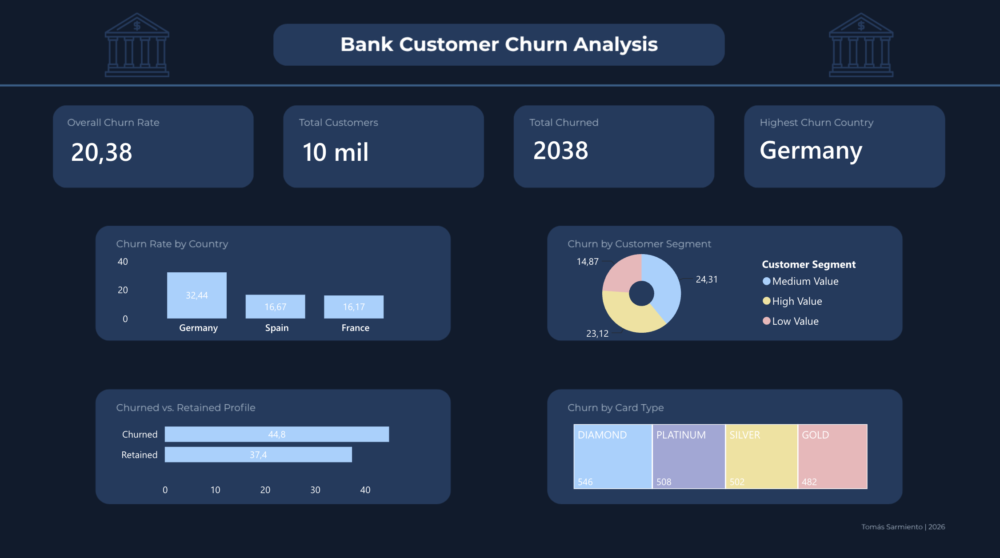

# Bank Customer Churn Analysis

## Overview
End-to-end data analysis project exploring why a bank loses customers. 
Built a relational database in PostgreSQL, wrote advanced SQL queries 
to uncover churn patterns, and visualized insights in Power BI.

## Tools
- PostgreSQL 17
- pgAdmin 4
- Power BI

## Skills Demonstrated
- SQL Joins
- Aggregations
- CTEs
- Data Cleaning
- Relational Database Design
- Data Visualization
- Business Analytics
- Customer Segmentation

## Database Structure
The original dataset was split into 3 related tables:
- **customers** — personal data (geography, gender, age)
- **accounts** — financial data (balance, credit score, products, card type)
- **feedback** — satisfaction score, complaints, points earned

## Questions Answered
1. How many customers did we lose and where?
2. What is the profile of customers who left vs those who stayed?
3. Which customer segment churns the most?
4. Do customers with credit score below their country's average churn more?
5. Do unsatisfied or complaining customers churn more?
6. Which card type has the highest churn rate per country?

## Key Findings
- Germany has a churn rate of 32.44%, nearly double France and Spain (~16%)
- Churned customers are on average 7 years older than retained customers
- Customers who filed a complaint have ~99% churn rate
- High and Medium Value customers churn more than Low Value customers
- Diamond card holders show the highest churn rate in France and Germany

## Dataset
Source: [Bank Customer Churn Dataset - Kaggle](https://www.kaggle.com/datasets/radheshyamkollipara/bank-customer-churn)

## Dashboard Preview

